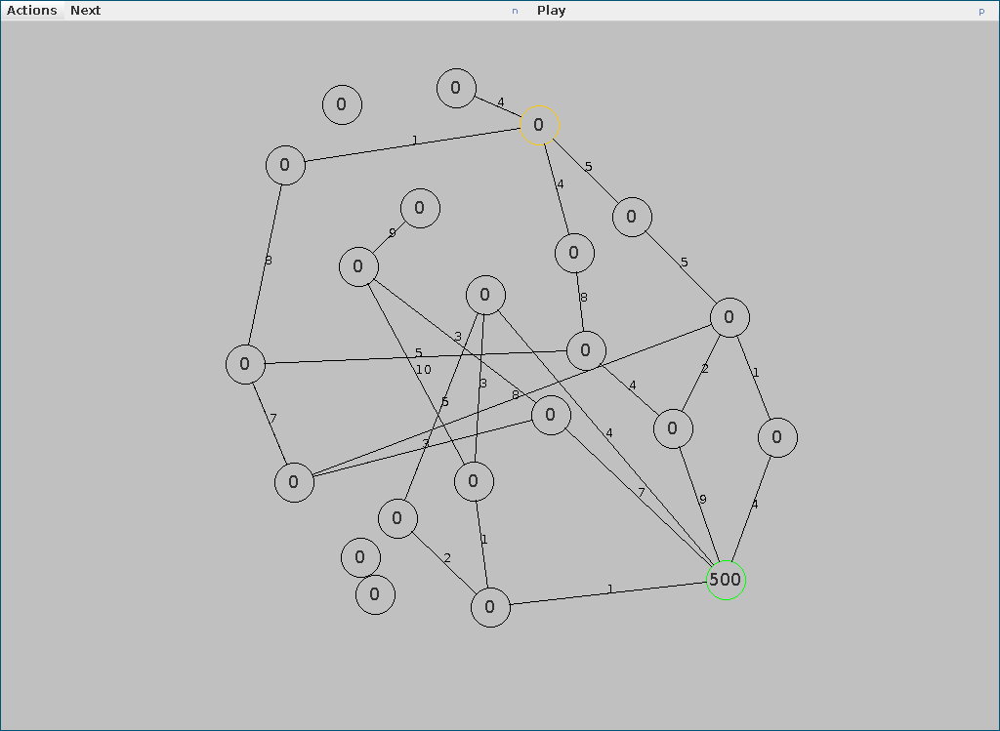
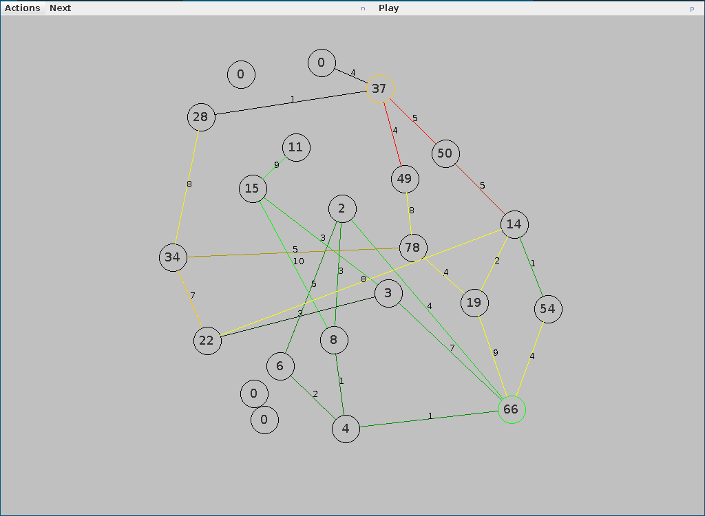
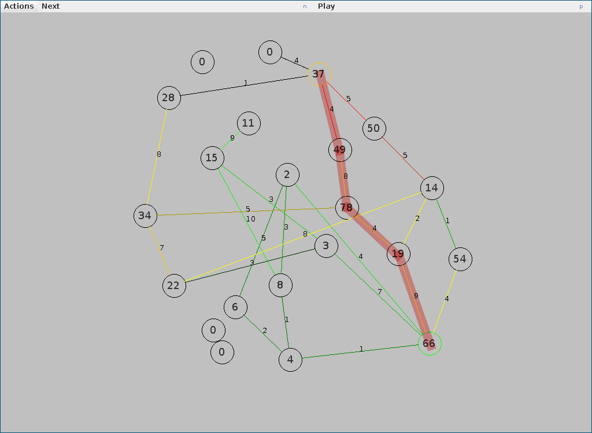

# Ant Colony Optimisation
Ant colony optimization on a weighted undirected graph(similar to vehicle routing problem).

Run AntColonyOptimisation.main() to run the demo. You need to have Java 16.

## Screenshots

### Initial state:

### After running algorithm:

### Optimised path(highlighted)

